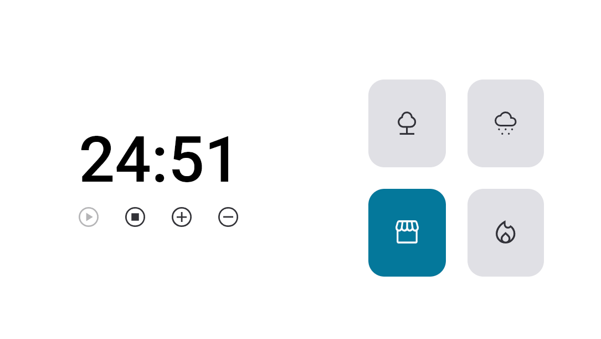

#  Focus Timer 2.0

Projeto para resolução de desafio proposto no módulo "Stage-05" do curso Explorer da rocketseat.

## Sobre o desafio

O desafio consiste na criação de uma aplicação para registrar o tempo de foco, onde o suuário pode selecionar um ruído branco para tocar de fundo durante o periodo de tempo definido.

## Preview 

## Funcionalidades

- Play   : aciona o timer;
- Stop   : para o timer;
- +    : aumenta em mais 5 minutos o tempo do timer;
- -    : diminui em 5 minutos o tempo do timer.

## Aprendizados

- Estrutura de dados HTML
- Estilos com CSS
- Funções em Javascript
- Eventos
- Adição de sons para a aplicação

## Stack utilizada

**Front-end:** JavaScript, HTML5 e CSS3

